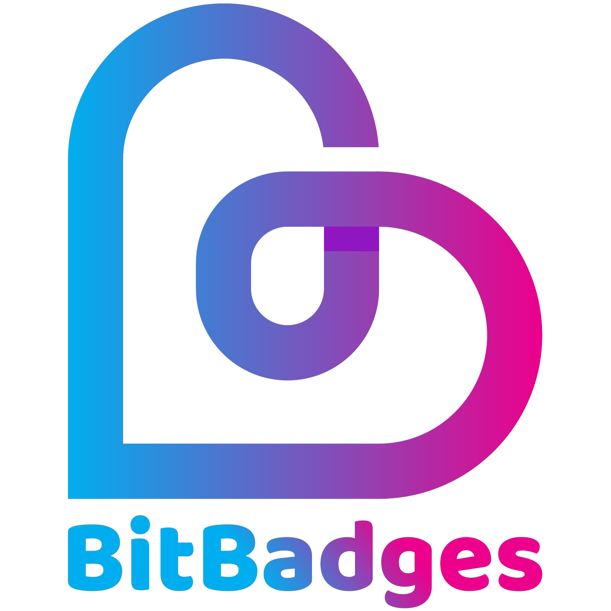
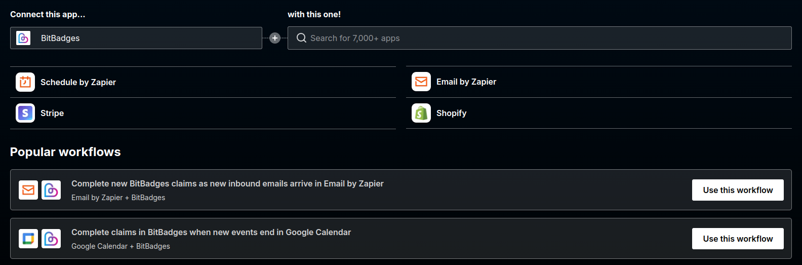

# 👋 BitBadges Overview

<figure><figcaption></figcaption></figure>

## Overview

BitBadges' services can be described as gating-as-a-service. We offer a multi-chain, state-of-the-art, community-driven token standard and suite of tools (Sign In with BitBadges, attestations, claim checking) for you to gate any app or service from websites to in-person events to Discord servers to repositories. Anything you want!

BitBadges can be simply thought of in two parts.&#x20;

1. Criteria Checking: Let us do the heavy lifting of checking the criteria through multi-chain authentication, criteria checks from 7000+ apps, on-chain badges, points, address lists, and much more!
2. Utility - Apps and services can seamlessly offer gated services like websites, URLs, tiered perks, subscriptions, anything to users who meet the criteria!

<figure><figcaption></figcaption></figure>

The BitBadges ecosystem aims to offer the full-stack of tools and services you may need from the required storage (blockchain, data indexing, off-chain data storage) to a universal multi-chain authentication standard to distribution to offline-first verification tools (in-person verification, website gated sign-ins) to communicating with your badge holders and more!

### **Motive for building BitBadges?**

The answer is simple. We believe in the potential of blockchains and a multi-chain world, but this potential cannot be realized with the current infrastructure and technology in place today. Current infrastructure is not scalable, lacks consistency, limited in features, and is limited to a single blockchain ecosystem at a time. BitBadges wants to help by building the critical infrastructure the right way!

This applies to not only our token standard but everything we do. We have built everything from the ground up to support multiple blockchain ecosystems all with the SAME interface. All while maintaining our core values of decentralization.

No longer do you need to support multiple interfaces for each blockchain ecosystem you want to support. For example, you can authenticate users from Cosmos, Solana, Bitcoin, and Ethereum all with the same interface. All users can own the SAME badges, use the SAME protocols, and so on. Before BitBadges, building multi-chain applications was a nightmare due to having to support all the various interfaces, protocols, and more for each blockchain ecosystem. Now, it is all in one place.

<figure><figcaption></figcaption></figure>

### Badges

Tokens (badges) are simply something that you can own digitally and prove ownership of it. You probably already use and own many digital tokens: verification checkmarks, a movie streaming subscription, concert tickets, etc. These tokens can be used for many [use cases](./#use-cases), each potentially offering you different utility and value. Some may have real-world use cases (e.g. entry to a concert), while some may be purely digital (e.g. verification checkmark). Some may signify something about your reputation (certifications), while some may just be collected for fun.

When combined with blockchain technology, badges become even more secure and more powerful, due to the unique properties of the blockchain (verifiable, decentralized, tamper-proof, and so on). However, the existing infrastructure and technology is not nearly good enough to realize the vast potential of digital blockchain tokens (not scalable, lacks consistency, and is limited to a single blockchain ecosystem at a time).

### Lists, Protocols, and Attestations

We also offer alternatives to badges to enhance your digital identity and portfolio:

1. **Address Lists:** Manage users from any supported blockchain with simple address lists. This streamlined alternative to traditional badges allows for efficient user management across multiple chains.
2. **Protocols / Maps:** Leverage reusable protocols to manage information such as preferences, reputation, and more across applications and chains. These protocols create a standardized way to store and access data, enhancing interoperability between different platforms and ecosystems.
3. **Attestations:** Use attestations to prove information, such as credentials, privately with zero-knowledge selective disclosure. This feature allows you to verify specific details without revealing unnecessary personal information, enhancing privacy and security in digital interactions.

These additional tools complement our badge system, providing a comprehensive suite for managing digital identities and interactions in the blockchain space.

### Universal Authentication - Sign In with BitBadges

Putting it all together, think of your BitBadges portfolio as a digital data backpack / identity. You own it. You control it. You take it with you everywhere you go and can use it to prove anything.

Thus, BitBadges becomes the all-in-one authentication provider, revolutionizing how users prove their identity and credentials across various platforms. With BitBadges, you can:

* Authenticate using your address from any supported blockchain
* Prove ownership of specific badges
* Verify particular attestations
* Demonstrate membership in address lists
* Validate adherence to protocols
* Connect with claims to check any criteria
* Create custom experiences for your users based on protocols, ownership and more!

All in one place! All outsourced to BitBadges!

This comprehensive approach to authentication works both digitally and in-person:

1. **Digital Authentication:** Use "Sign In with BitBadges" for seamless access to websites and applications. This method allows you to prove your identity and credentials without creating new accounts or sharing unnecessary personal information.
2. **In-Person Authentication:** Utilize QR codes to verify your identity, badge ownership, or attestations in real-world scenarios, such as event entry or age verification. Export the QR codes to formats like Apple Wallet or any prefererd format.

<figure><figcaption></figcaption></figure>

### BitBadges Claims

Claims are a core aspect of BitBadges allowing you to check criteria from over 7000+ apps and integrations. Tons of plugins are supported directly no-code and in-site, but we also have flexible implementation options to allow you to add your own logic (webhooks, API, building / publishing your own plugin).

The most powerful feature of claims is that they are compatible with every other aspect of BitBadges (ex: gating badge distribution with claims, Sign In with BitBadges and check claims all in one flow).

Combine criteria checks to gate anything from content to websites to badge distribution to anything you want! Let BitBadges do the heavy lifting, enabling you to focus on offering your core utility.

<figure><figcaption></figcaption></figure>

### Zapier

BitBadges has a Zapier integration that allows you to connect BitBadges to any app supported by Zapier ([https://zapier.com/apps](https://zapier.com/apps)). Automatically trigger BitBadges claims or trigger actions upon successful claims.

## Use Cases


[use-cases.md](overview/use-cases.md)


Because you can create a badge for anything, there are infinitely many possible use cases for BitBadges! As you collect more badges, your portfolio grows, and you can show it off to others.

Below are some of our favorite use cases:

* **Attendance Badges -** Mint an attendance badge for an event, trip, etc as a souvenir!
* **Memberships/Subscriptions/Premium Content -** Badges are all time-based, so you can offer time-dependent memberships / subscriptions and offer the utility only to those who own the badge at a certain time!
* **Access Tokens** - Use badges as access tokens. This can be digital (websites, Discord servers, etc) or in-person (tickets, event entry, etc).
* **Recognition of Achievement or Completion** - Job certifications, awards, athletic accomplishments, completing a class, etc.
* **Authentication / Tiered Services -** Companies can outsource their authentication to Web3 / [Blockin](https://app.gitbook.com/o/7VSYQvtb1QtdWFsEGoUn/s/AwjdYgEsUkK9cCca5DiU/) and verify ownership through tiered services badges (family plan badge vs normal user badge). Cheaper, more secure, and less work!
* **Protocols:** Use BitBadges to implement multi-chain protocols, such as an attendance protocol or a follow protocol.
* **Truth Badges:** In a world of deep fakes and fake news, badges can serve as the undeniable source of truth for things.
* See more use cases [here](broken-reference/)!

## 100x Token Standard

The BitBadges token (badge) standard is state-of-the-art compared to existing token standards (ERC20, ERC721, etc) and does not require smart contracts. The standard is ever-evolving and natively supports never-before-seen features like time-dependent ownership, fine-grained transferability requirements, and hybrid off-chain balances. We like to think of BitBadges as a 100x improvement over existing token standards.

In addition to the standard features of existing token standards (mint, transfer, approve, etc), we expand and offer the following functionality:

* [**Time-Based Balances**](overview/how-it-works/time-dependent-ownership.md)**:** Badge balances are all time-dependent which allow you to, for example, transfer only a specific period of time (e.g. subscription token for a month), clearly define token unlock schedules, or approve a transfer only for a specific period of time.
* [**Off-Chain Balances:**](overview/how-it-works/balances-types.md) New ways to store and track balances, in addition to the standard on-chain storage of balances. Storing balances off-chain can offer over 1000x better scalability and much better user experience because users never need to transact with the blockchain. Badges are auto assigned to their wallets. This also allows seamless connection to any Web2 app since you are not limited to only blockchain data anymore.
* [**Fine-Grained Transferability and Approvals Customization**](overview/how-it-works/transferability.md)**:** Simply abstracting transferability to "transferable" or "non-transferable" is too simple for many use cases. We recognize that transferability is a complex protocol of who can transfer to who? at what times? what badges? how many? revokable? freezable? etc.
  * Example: Only those who own the verified checkmark badge can transfer the badge IDs 1-5 to each other from Monday to Tuesday 12PM, but badges will be revokable by the manager after that.
  * [**Must Own Badges:** ](overview/how-it-works/transferability.md)Restrict sending and receiving badges to only those who own specific badges of other collections (e.g. a KYC badge, a verified badge).
  * [**Fine-Grained Approvals:** ](overview/how-it-works/transferability.md)In addition to simply specifying approval of X amount, you can customize approvals further with details like predetermined balances (x1 of ID 1, then x1 of ID 2), max number of transfers allowed, and more!
  * [**Incoming Approvals:** ](overview/how-it-works/transferability.md)In addition to having control over your outgoing transfers, have control over your incoming transfers via incoming approvals.
    * Ex: Block certain users from transferring to you. Block all transfers unless you opt-in to receiving them.
  * And more!
* [**Customizable Permissions**](overview/how-it-works/manager.md)**:** Each collection has fine-grained customizable permissions that can be optionally set and executed by a special party called the manager, such as archiving the collection, deleting it, updating its metadata, updating transferability, etc.
* [**Time-Based Details**](for-developers/core-concepts/general/timelines.md)**:** Important collection details such as metadata are time-based, allowing you to automatically commit to updating it at a future time without needing to transact at that time. Ex: Set the metadata to be one value from January 1 to January 10 and then auto-change to another value!
* [**Batch Transfers**](overview/how-it-works/time-dependent-ownership.md)**:** Batch transfer badges instead of only being able to transfer one by one.
  * Instead of needing 1000 transactions to send 1000 unique non-fungible badges in a collection (e.g. x1 of Badge ID 1, x1 of ID 2, ...), you can batch all into one transaction efficiently (e.g. send x1 of Badge IDs 1-1000).

And much more!
