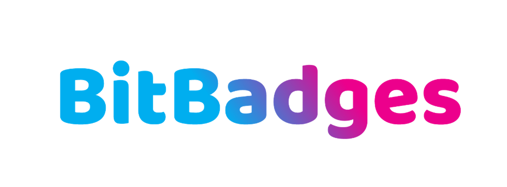

# 👋 BitBadges Overview

<figure><figcaption></figcaption></figure>

## Overview&#x20;

BitBadges offers an open-source, community-driven suite of tools focused on cross-chain issuance of digital tokens (badges). Check out the BitBadges app at [https://bitbadges.io](https://bitbadges.io). To learn more about BitBadges (the company), visit [https://bitbadges.org](https://bitbadges.org).

Our goal is simple.&#x20;

**Enable tokenization for any use case such that creating and sending badges is as easy as sending an emoji on iMessage, sending a Tweet, or attaching a file to an email.**

BitBadges helps users establish social identity and reputation through blockchain technology and badges, allowing the viewing of positive achievements and negative reputation (e.g. scammer badge). BitBadges aims to support a developer ecosystem of unique projects that use its blockchain, API, and other provided tools. Lastly, BitBadges also aims to enable a peer-to-peer creator economy for individuals to offer services via badges (e.g. gated content, ticketing).

## Use Cases


[Broken link](broken-reference)


Badges are customizable, so you can issue a badge for anything from a gym membership to a college diploma to a store receipt.

## Core Principles

How do we aim to achieve our goal?

* **Cross-Chain**: Develop a cross-chain token standard.&#x20;
  * Applications should not have to limit themselves to a single blockchain community (e.g. only Ethereum users, only Cosmos users, etc), as they currently have to.
* **User-Friendly**: Prioritize user experience over everything else.&#x20;
  * Users should not even need to know what a blockchain is or that they are using a blockchain. No mention of crypto or blockchain native terms.&#x20;
* **Developer-Friendly:** Make developing on top of BitBadges as easy as possible/
  * Long term, the goal is to have an ecosystem of thousands of developers building projects on top of BitBadges.
* **Dynamic**:  Create a single, dynamic token standard that is ever-evolving.
  * Token standards should be flexible and continuously adding new functionality, not set in stone.
  * Existing token standards (e.g. ERC721, ERC20, etc) are limited in functionality, and it is difficult to adopt new ones.

## Products


[Broken link](broken-reference)


BitBadges offers an L1 delegated proof-of-stake blockchain built with Cosmos SDK that enables the natively cross-chain issuance of digital tokens (e.g. an Ethereum user can seamlessly issue a badge to a Cosmos user). The blockchain is able to attain instant transaction finality using Tendermint and natively supports users from multiple Layer 1 blockchains (Ethereum, Cosmos) via IBC and account mappings.


[Broken link](broken-reference)


BitBadges provides their own website to view and interact with the BitBadges blockchain at [https://bitbadges.io](https://bitbadges.io). This site aims to be the all-in-one site for any crypto user from any blockchain. See a user's badges, digital collectibles, transaction history, reviews, etc all on one site.


[Broken link](broken-reference)


The BitBadges Indexer is a tool used to query and store data that is not natively stored by the blockchain (e.g. user activity, metadata, etc). The BitBadges team runs their own indexer and provides a user-friendly developer API to allow developers to build on top of it with.


[Broken link](broken-reference)


The BitBadges SDK is a JavaScript library that provides all the tools you need to develop on top of BitBadges.


[Blockin](http://localhost:5000/o/7VSYQvtb1QtdWFsEGoUn/s/AwjdYgEsUkK9cCca5DiU/)


Blockin is a universal, multi-chain sign-in interface for Web 3.0. While Blockin is not an official BitBadges product, Blockin was co-created and is maintained by one of the BitBadges founders, trevormil.eth. Blockin plans to integrate many features using BitBadges, such as badge-gating sign-ins for websites.


[standards.md](for-developers/need-to-know/standards.md)


We are decentralizing the process of proposing / creating token and metadata standards ([Standards](for-developers/need-to-know/standards.md)). Have an idea for a new token standard? Propose it! Standards can define anything from the expected permissions, transferability, or even how metadata is interpreted.

## Links

BitBadges Main Site - [https://bitbadges.org](https://bitbadges.org)

BitBadges App - [https://bitbadges.io](https://bitbadges.io)

GitHub - [https://github.com/bitbadges](https://github.com/bitbadges)

Project Board -  [https://github.com/bitbadges/projects](https://github.com/orgs/BitBadges/projects)

Discord - [https://discord.com/invite/TJMaEd9bar](https://discord.com/invite/TJMaEd9bar)

LinkedIn - [https://linkedin.com/company/bitbadges](https://linkedin.com/company/bitbadges)

Twitter - [https://twitter.com/BitBadges\_](https://twitter.com/BitBadges\_)

Facebook - [https://facebook.com/profile.php?id=100092259215026](https://facebook.com/profile.php?id=100092259215026)

Instagram - [https://instagram.com/bitbadges\_official/](https://instagram.com/bitbadges\_official/)

Slack - [https://bitbadges.slack.com/join/shared\_invite/zt-1tws89arl-TMSK\_4bdTLOLdyp177811Q#/shared-invite/email](https://bitbadges.slack.com/join/shared\_invite/zt-1tws89arl-TMSK\_4bdTLOLdyp177811Q#/shared-invite/email)

Crunchbase - [https://www.crunchbase.com/organization/bitbadges](https://www.crunchbase.com/organization/bitbadges)

Reddit -[https://www.reddit.com/r/BitBadges/](https://www.reddit.com/r/BitBadges/)

Telegram - [https://t.me/BitBadges](https://t.me/BitBadges)

