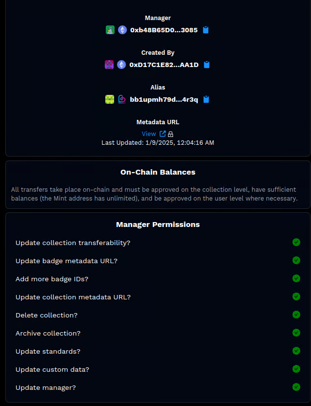

# Overview

Authentication becomes seamless with BitBadges, offering a unified OAuth 2.0 interface across different blockchain ecosystems. Instead of managing multiple interfaces, BitBadges allows you to authenticate users from any chain, verify attestation signatures, verify ownership of badges, NFTs, integrate with any supported app / plugin, and more all in one flow! This is the all-in-one flow for authentication and authorization.

Think of Sign In with BitBadges like replacing the Sign In with Google button on your site. Outsource all the heavy lifting of authentication, allowing you to focus on your core utility.&#x20;

<figure><figcaption></figcaption></figure>

**Authorization URL:** https://bitbadges.io/siwbb/authorize

**Token URL:** https://api.bitbadges.io/api/v0/siwbb/token

**Revoke URL:** https://api.bitbadges.io/api/v0/siwbb/token/revoke

We envision most use cases will just want to authenticate users for their application; however, this flow also supports OAuth authorization scopes for the BItBadges API.

<figure><figcaption></figcaption></figure>

## Quickstart

As you read along, you can refer to the [BitBadges quickstart repo](https://github.com/BitBadges/bitbadges-quickstart) to get started and as an implementation reference. This has a full end-to-end implementation of Sign In with BitBadges.

## **Execution Flow**

**Scope of SIWBB**

Think of SIWBB as outsourcing the core username / password step with a cryptographic signature plus additional verification criteria (like verifying badges or user attestations). Pretty much, you can use our libraries, tools, and user interface to help you build your set of criteria for verification and handle the verification logic. This can include the following

* Prompting and verifying users for proof of address
* Querying asset ownership (badges, address lists, NFTs on other chains)
* Verify attestation signatures from other issuers
* Check sign-ins of other socials (Discord, GitHub, Google, X)

We leave the rest up to you. SIWBB does not handle sessions, etc. Those are all to be implemented alongside SIWBB using industry standards such as JWTs, or whatever method you prefer.

**Is the flow OAuth 2.0 compatible?**

Yes, we are OAuth 2.0 compatible and integrate with different OAuth 2.0 helper tools and frameworks.

**Key Parts**

BitBadges authentication is structured into a couple components: verifying address ownership and verifying custom requirements like asset ownership, attestations, or off-chain signatures. Depending on your requirements, you can tailor your implementation by utilizing one or more of these components. We aim to provide maximum flexibility in the design process.

"Sign In with BitBadges" encompasses support for all components within a unified interface and even allows you to add a BitBadges claim too for further integrations and verification logic.

However, you have the freedom to customize and integrate these components according to your needs, allowing for a tailored authentication solution.

#### Execution Flow:

1. **User Interaction:**
   * Users access a personalized BitBadges URL, either directly or through a popup window. At this URL, they prove address ownership, generating a unique authorization code.
2. **Authentication Details Retrieval:**
   * Authentication details can be obtained either through a callback from the popup window or retrieved from the user's BitBadges account, specifically under the "Authentication Codes" tab, using the associated code ID. This depends whether you are implementing digital or QR code authentication.
3. **Verification Process:**
   * At verification time, which may be immediate or delayed according to your implementation, utilize the BitBadges API and SDK to verify address ownership and other additional logic.
4. **Application-Specific Logic:**
   * Implement application-specific requirements, such as session management, prevention of replay attacks, and any other custom logic necessary for your use case. This step ensures the seamless integration of BitBadges authentication into your application workflow.

<figure><figcaption></figcaption></figure>

**Verifying Address Ownership**

Verifying address ownership entails users signing in to BitBadges. We reuse the address signature from the user's original BitBadges sign in as proof of identity / address for your application as well. This enables them to not have to sign another message which is poor user experience.

The process is cost-free and doesn't involve blockchain transactions, just simple message signatures.

## **Digital or QR Authentication?**

Authentication can be facilitated in many settings (in-person, digitally, etc). This is an important question to ask before starting your implementation.

**Immediate (Digital)**

You can authenticate users and verify badge ownership, such as badge-gating a website. This process is immediate, meaning as soon as a user is prompted, you can proceed to the verification step. Nothing needs to be cached or stored because the details are immediately used.

<figure><figcaption></figcaption></figure>

**Delayed Authentication (QR Codes)**

Or, you can pre-generate with authentication QR codes. For example, you may not expect users to have wallets handy at authentication time, so you have them pre-generate their authentication details to present to you at authentication time. An example use case might be presenting a QR code at a ticket gate in real life.

<figure><figcaption></figcaption></figure>

