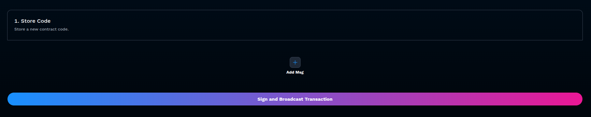

# How Do I Gate XYZ?

BitBadges provides flexible ways to gate (restrict access to) various types of content and utilities. This guide will walk you through the most common gating scenarios and how to implement them in the recommended ways. Note: BitBadges aims to be as flexible as possible, so there are often multiple ways to achieve the same result.

```
Pro Tip: Browse to see if there is an ecosystem tool that meets your needs
```

## Gating a URL / Content 🔗

The simplest way to gate a URL is to use BitBadges' built-in URL gating feature:

1. Go to the [Create Claim page](https://bitbadges.io/create)
2. Set up your desired criteria (e.g., badge ownership, password, points, etc.)
3. In the "Rewards" section, select "URL"
4. Enter the URL you want to gate and select the parameters for showing the URL (e.g. min one claim)
5. Save and publish your claim

Once published, users will need to successfully complete the claim process to view the URL. This is perfect for:

* Private Discord invites
* Google Doc/Drive links
* File downloads
* Software downloads
* Exclusive website access
* Event registration links
* And more!

**Pro Tip**: For additional security, consider using one-time-use URLs or implementing additional verification on your destination website.

## Gating a Discord, Telegram, Slack Channel 💬

Instead of gating a URL / content, you can also use certain plugins to auto implement utility for you with no-code. For example, assign a Discord role to users who successfully claim.

This is a powerful tool because then you can create gated channels and offer further gated experiences however you see fit!

<figure><figcaption></figcaption></figure>

## Collect User Emails, Socials, Form Questions 📝

Use the Forms plugin to collect user inputs and social identifiers. This allows you to maintain a list of users who you want to offer your gated utility too (e.g. send emails to the emails you collect), All storage is handled on our end, and you can simply view the collected details in-site and export them to CSV.

This is great for services like newsletters, custom services, and much more! If you need a more programmatic solution, you can collect this same data via [Zapier](https://zapier.com/apps/bitbadges/integrations) or at your own endpoint via webhooks or custom plugins. See developer docs for more information.

<figure><figcaption></figcaption></figure>

<figure><figcaption></figcaption></figure>

## Gating a Digital Service (Websites) 🌐

Gating your website is similar to URLs, but you will need authentication on your end.

1. Create a claim (see above or tutorials)
2. Implement Sign In with BitBadges on your website
3. On the authorize page, you can prompt users to send you private attestations, complete claims, check badge ownership, or any other criteria you want to gate access to. All in one flow!
4. On your end, you simply can check this all in one flow (e.g. claim success, authentication, any other criteria)

This flow can be used for any digital service, including:

* Discord servers
* Google Docs
* GitHub permissions
* Telegram channels
* Slack channels
* SaaS
* Web apps
* In-app experiences
* Games
* And more!

## Gating an In-Person Service (Events, etc.) 🎫

1. Create a claim (see above or tutorials)
2. This will follow the same flow as the website gating above, expect you will use the QR code feature of Sign In with BitBadges to gate access to the event.
3. Use any session management tool to manage the event (e.g. stamping users in, etc.)
